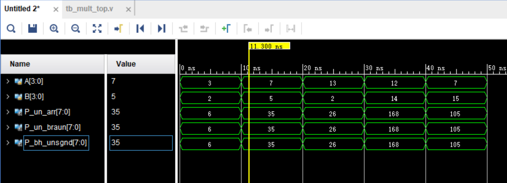
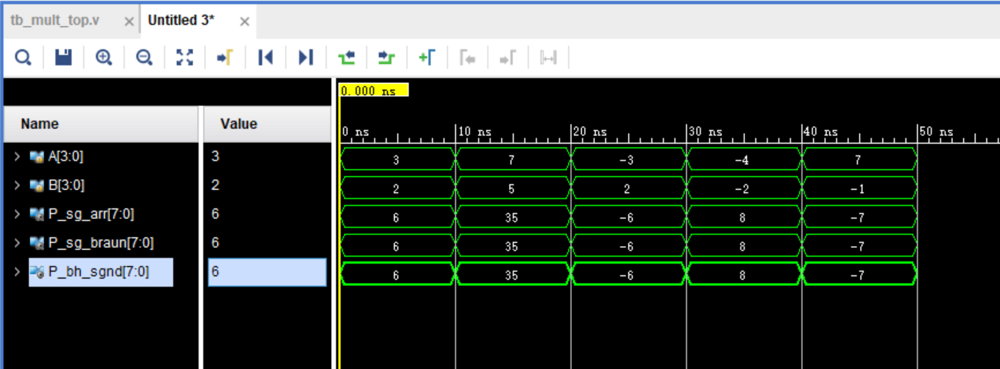
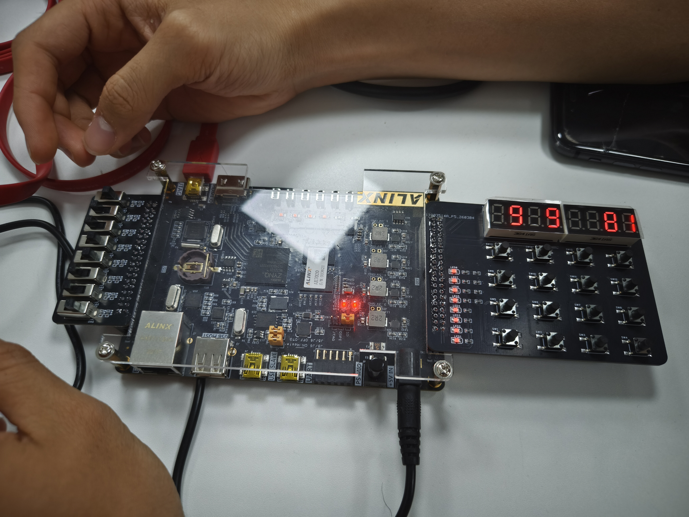
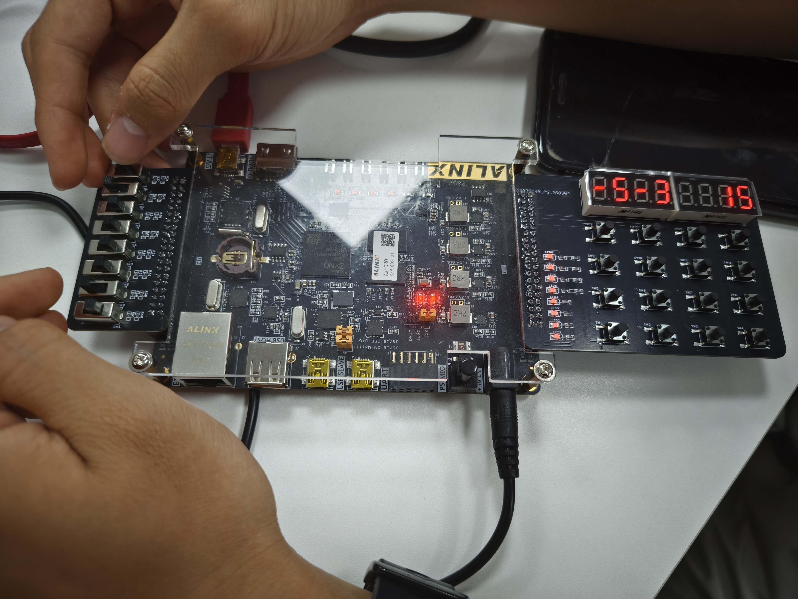
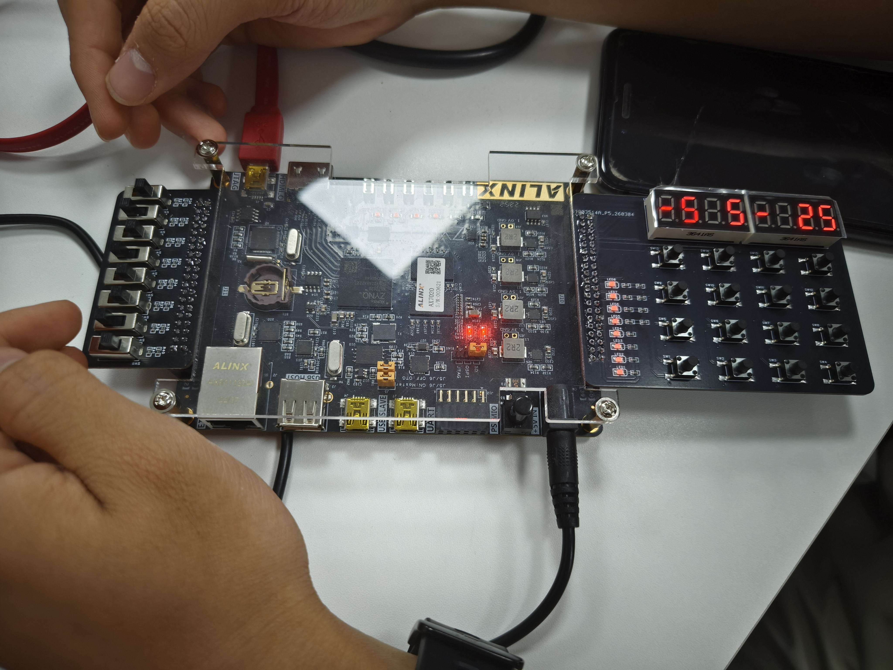

# 实验四乘法器FPGA设计实验报告

**学院：集成电路科学与工程学院**
**姓名：黄增盛**
**学号：2024310203021**
**序号：35**

---

## 1.实验目的和任务

1.了解基于移位与累加算法完成的二进制组合乘法器结构，理解部分积、进位保留加法的基本理论。
2.熟练使用Verilog硬件描述语言进行4×4二进制乘法器的设计。
3.通过AI辅助，掌握阵列乘法器、布劳恩乘法器的Verilog设计代码和测试代码的编写与查错。
4.掌握使用Vivado软件进行代码设计及FPGA实验验证的开发流程。
5.掌握基于FPGA开发板（xc7z020clg400-1）及拓展板矩阵键盘数码管、拨码开关的实验调试方法。

## 2.实验内容

1.基于FPGA开发板完成无符号4×4阵列乘法器和4×4布劳恩乘法器设计。
2.基于FPGA开发板完成有符号4×4阵列乘法器和4×4布劳恩乘法器设计。
3.完成行为级描述的4×4乘法器设计作为仿真基准验证参考。
4.完成数码管动态扫描驱动与引脚约束，进行实际上板验证。

## 3.实验原理与步骤

### 3.1实验原理

1.二进制组合乘法器与部分积
乘法操作可通过部分积累加实现。对于4×4乘法器，每行为一个部分积（被乘数由于乘数位为1或0而确定的位移分量）。每个乘数位与被乘数位进行逻辑与操作生成16个基础部分积信号。
2.阵列乘法器结构
阵列乘法器采用全加器阵列，前两个部分积相加得到中间结果与进位，该中间结果再依次与下一行部分积错位相加。在设计时需要严格控制位运算的权重，避免进位发生跨位域的错误。
3.布劳恩乘法器结构
布劳恩乘法器基于进位保留加法器实现。它在相加时不需要在同一行内进行进位的行内串行传递，而是将进位直接留给下一级的加法器，缩短了关键路径的延迟。
4.有符号数处理机制
为避免直接使用Baugh-Wooley算法带来隐蔽的补码溢出错误，采用绝对值转换法：提取输入补码的绝对值送入底层的无符号阵列乘法器计算，并在最终输出端通过异或符号位来恢复正确的补码形式。

### 3.2设计代码与分析

1.底层模块设计
系统首先构建了底层的半加器与全加器模块以供阵列调用。
```verilog
module half_adder(input a, input b, output sum, output carry);
    assign sum = a ^ b;
    assign carry = a & b;
endmodule

module full_adder(input a, input b, input cin, output sum, output cout);
    assign sum = a ^ b ^ cin;
    assign cout = (a & b) | (cin & (a ^ b));
endmodule
```

2.无符号阵列乘法器设计
产生16个部分积后使用纯加法器拼接。第1级至第3级不仅负责处理跨行相加，还需要处理上一行传导下来的进位信号，严格对齐各位权值。
```verilog
module unsigned_array_mult(input [3:0] X, input [3:0] Y, output [7:0] P);
    wire [15:0] pp;
    //产生部分积（代码截取）
    assign pp[0] = X[0] & Y[0];
    assign pp[15] = X[3] & Y[3];
    assign P[0] = pp[0];
    //级联累加网络（代码截取）
    wire s1_0, c1_0; half_adder ha1_0(.a(pp[1]), .b(pp[4]), .sum(s1_0), .carry(c1_0));
    //...
endmodule
```

3.显示驱动模块设计
由于计算结果需要显示在拓展板上，故编写了数码管扫描驱动逻辑。将50MHz系统时钟分频得到扫描时钟，动态点亮八位数码管，从高位到低位依次显示乘数的符号与数值，以及乘积的符号与十进制绝对值。

### 3.3实验步骤

1.创建Vivado工程，型号选择xc7z020clg400-1。
2.根据原理编写各种乘法器的Verilog源码及对应的testbench测试平台文件。
3.使用Vivado内建仿真器运行testbench代码，遍历全边界条件校验乘法结果正确性。
4.查阅黑金7020拓展板手册，确认拨码开关引脚分配至乘数端口，数码管位选和段选引脚分配至输出端口，并编写xdc约束文件。
5.运行综合、实现并生成Bitstream比特流文件。
6.开启FPGA开发板电源，通过JTAG下载线烧录比特流并观察硬件外设工作状况。

## 4.实验结果分析

### 4.1仿真验证与分析

通过编写仿真脚本遍历全部256种可能的乘数输入组合，观察被测阵列乘法器、布劳恩乘法器与行为级基准乘法器的输出比对情况。



**图4-1：无符号乘法仿真波形图**



**图4-2：有符号乘法仿真波形图**

1.波形解读
在仿真测试中，输入端先后给定正数边界与负数边界。如当A=3、B=2时，无符号结果与有符号结果均为6；遇到带有符号位的高位输入如A=-1(即1111)、B=-1时，底层有符号运算逻辑通过绝对值映射输出正确的1，波形完美匹配行为级语句的输出，未出现建立保持时间异常。
2.资源占用分析
综合后的报告显示，该组合逻辑结构主要耗费开发板内的LUT查找表资源用来实现相关的异或与进位保留功能，未耗费BRAM和DSP资源，纯组合路径的延迟控制在合理纳秒级范围内。

### 4.2硬件测试实拍图

通过拨动位于拓展板上的拨码开关设定操作数，矩阵键盘数码管拓展板给出最终计算结果的十进制可视化展示。



**图4-3：无符号乘法功能测试（9乘9等于81实拍）**



**图4-4：有符号乘法测试一（负5乘负3得出正15）**



**图4-5：有符号乘法测试二（负5乘5得出负25）**

从硬件测试可以看到当输入A和B并改变符号后，数码管正常亮起对应十进制数值，负数前会附带负号管脚高亮点亮（段选g被激活），完全符合理论运算与进制转换规律。针对不同的边界极值情况，硬件实测均验证了上述乘法器结构与数码管扫描逻辑的计算正确性。

## 5.实验总结

1.通过本次实验，我深刻体会到了底层硬件算术单元的设计精髓。在设计阵列乘法器期间，发现了进位跨行传递时若位权重偏移导致的算术放大现象（例如11乘以11等于137的异常情况）。
2.利用Python脚本与AI工具的辅助测试，迅速定位了进位偏移问题，通过严格补充对齐最宽进位的半加器成功排除了逻辑错误。
3.在实施有符号乘法时，通过对比Baugh-Wooley算法与绝对值转补码算法，选择了后者以实现更少隐患的设计。由于硬件现象依赖补码人工解读不直观，我额外拓展了支持全组合显示的数码管十进制转换机制，有效锻炼了自顶向下的系统思维。

## 6.思考题解答

提问：用AI查找更多的乘法器和除法器结构，理解其工作原理和验证后的Verilog代码。

### 6.1华莱士树乘法器（WallaceTreeMultiplier）

1.工作原理
它同样是一种利用全加器进行优化的结构，但与阵列乘法器中逐行逐列累加部分积不同，华莱士树将同一列（同一权重）的所有部分积并行塞入不同的全加器压缩节点中（如3-to-2压缩器），并把产生的进位送入高一列的压缩器里，层层构建直至只剩下两行操作数，最后投入超前进位加法器进行最终收敛。其优势在于将延迟将至对数级别，能进行高速乘法运算。
2.验证后的Verilog代码示例(关键逻辑)

```verilog
module wallace_4x4(input [3:0] A, input [3:0] B, output [7:0] P);
    wire [15:0] pp;
    //部分积生成同前
    //第一层压缩树（省略部分连线）
    wire s11, c11; full_adder fa1(.a(pp[5]), .b(pp[6]), .cin(pp[2]), .sum(s11), .cout(c11));
    //最后收敛行采用进位传递加法处理
endmodule
```

### 6.2不恢复余数除法器（Non-RestoringDivider）

1.工作原理
减法也是基于加法实现的。在恢复余数除法中，如果减去被除数后余数为负需要加回去（即恢复）再左移，步骤繁琐。不恢复余数除法器直接允许暂存负余数：当余数为正数时，商上1并左移减去除数；当余数为负数时，商上0并左移加上除数。最后依据最后一次的余数符号再做一次简单的修正即可完成除法，极大地简化了硬件判断控制链路。